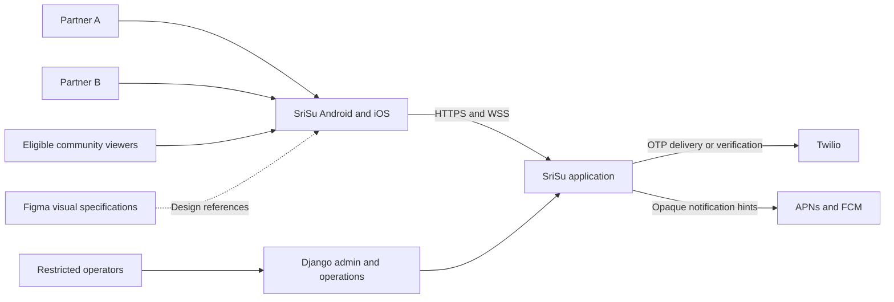
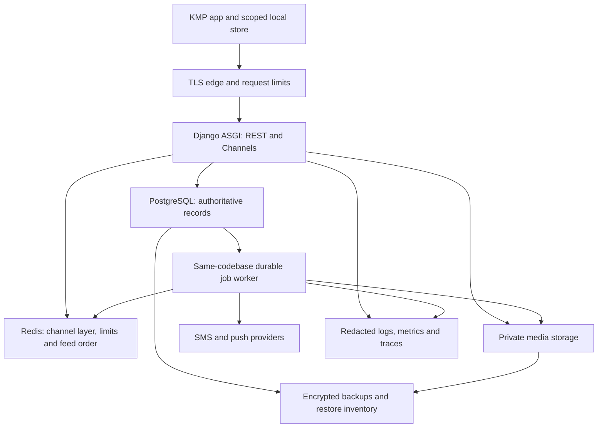
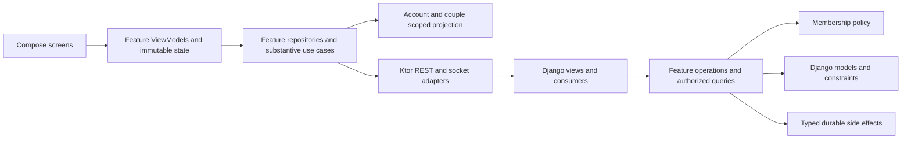
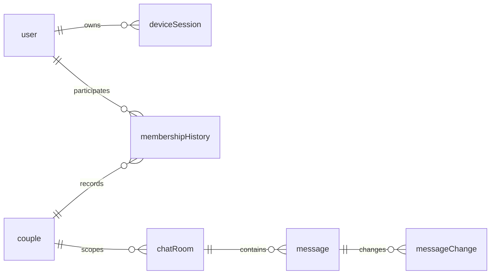
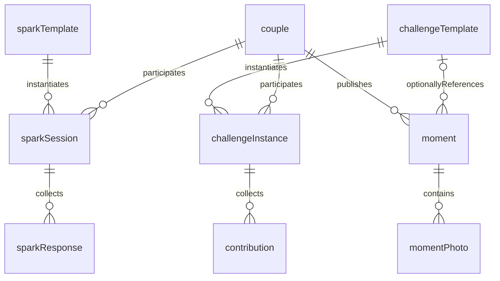

# Target architecture and operating model

**PROPOSED 0.1.** All new components, limits and targets below are proposals,
not deployed capabilities. [Current evidence](01-current-system.md) identifies
what already exists. Backend owns truth; clients own pending intent and a scoped
projection of server state; Figma owns intended presentation and interaction.

## Quality attributes and workload envelope

No production traffic, team capacity, budget, region or usage telemetry was
provided. Use these scenarios to size experiments, not as a capacity promise.

| Input | Launch experiment | Growth experiment |
| --- | --- | --- |
| Daily active couples / people | 1,000 / 2,000 | 10,000 / 20,000 |
| Concurrent authenticated sockets | 400, including multiple devices | 4,000 |
| Messages per day | 30,000: 30 per active couple | 500,000: 50 per active couple |
| Message burst | 20 commands/s for 5 minutes | 200/s for 10 minutes |
| Feed requests | 10,000 pages/day; 50/s burst | 100,000/day; 200/s burst |
| Moment publications | 100/day, average two compressed 0.5 MiB photos | 2,000/day, same average |
| Moment media written | 100 MiB/day; about 3 GiB per 31-day retention window | 2,000 MiB/day; about 61 GiB per window |
| Photo delivery | 20 views/photo: about 59 GiB/month | About 1.14 TiB/month |
| SMS attempts | 3,000/month, including resends; burst 2/s | 30,000/month; burst 10/s |
| Chat media | Initially budget separately at 100 uploads/day × 1 MiB and 30-day scenario; actual retention unresolved | 2,000/day × 1 MiB; do not extrapolate unbounded history for free |

Message payload/storage estimate: at 2 KiB per stored message including an
allowance for indexes, launch adds about 1.7 GiB/month, growth 28.6 GiB/month,
before backups, replicas, media and PostgreSQL overhead variation. Measure row
and index sizes on synthetic data. Legal/product retention may dominate compute.

Proposed monthly planning envelope, **not a vendor quote**: launch infrastructure
USD 100–250 excluding SMS and human operations; growth USD 300–1,000 before usage
measurement. Include app/worker, database with backups, Redis, storage, delivery,
monitoring and restore capacity. Validate actual region/provider prices before
approval. SMS cost = delivered/billable attempts × destination unit price plus
provider/verification fees. A hypothetical USD 0.05/attempt gives USD 150 or
1,500/month in these scenarios; it is not Twilio's verified price for Nepal or
any other market. Budget alerts at 50/80/100%, destination allowlists and an
approved daily spend ceiling are launch requirements. Do not silently switch
providers or purchase infrastructure based on these examples.

| Proposed target | Measurement and failure budget |
| --- | --- |
| Ordinary API p95 <300 ms, p99 <1 s; discovery p95 <500 ms | Edge-to-response server latency, excluding uploaded bytes/provider time; representative PostgreSQL data and warm/cold cache results separately |
| Durable message ack p95 <500 ms, p99 <1.5 s | Client command to post-commit ack on stable regional network; distinguish server commit latency from network latency |
| Foreground recipient synchronization p95 <1 s, p99 <3 s | Sender committed timestamp to recipient projection, using clock offset; forced lost-event test included |
| Reconnect recovery p95 <3 s for 100 missed changes | Reconnect → authorized checkpoint → reconciled local state; measure 1,000-change case separately |
| First useful chat content <300 ms cached / <2 s online p95 | Screen-open to usable history on agreed mid-range Android and oldest supported test iPhone; cached content must pass current account/couple scope |
| Startup <2 s warm / <3 s cold p95; slow frames <1% in standard scroll | Platform profilers, release builds, agreed devices; 60 Hz frame budget 16.7 ms. Separate image decode, list diff and network costs |
| Memory <200 MiB steady in reference chat run; no upward trend after 50 room switches | Platform allocation tools; tune device-specific ceilings after measurement |
| History page <=100 KiB without media; bounded thumbnails and prefetch | 50 representative messages; on-device network capture. No image originals fetched for list previews |
| Unexpected server errors <0.5% monthly; durable action loss = zero in fault-injection acceptance | Exclude intentional 4xx from availability numerator, report them separately. Zero in tests is not proof of zero real-world loss |
| Launch availability 99.5%; growth proposal 99.9% | External critical-path probes; respectively ~216 / 43 minutes per 30 days. Upgrade deployment redundancy before claiming the higher target |
| Backup RPO <=15 min, restore RTO <=4 h | PostgreSQL PITR plus media inventory/versioning, actual timed restore to isolated environment monthly |
| Notification/job p95 lag <30 s; alert oldest eligible job >2 min | Pending-job age, retries/dead letters. Expiry and authorization must not depend on worker timeliness |

## System context

Push delivery is proposed, not verified existing infrastructure. A notification
is a wake-up hint; it is neither a message database nor an authorization grant.

## Runtime containers

Launch topology: one region, one application deployment with separately supervised
web and worker processes, PostgreSQL, Redis and private storage. Prefer a managed
database with tested backups if budget permits. A single app instance is an
explicit launch availability tradeoff. Two app replicas improve deployment
continuity after readiness/drain tests; they do not fix a single database or edge
failure. Keep database/Redis on private networking. No Kubernetes, Kafka or new
service fleet is required by the assumed workload.

## Module ownership and interfaces

These are logical boundaries first. Do not move all models between Django apps:
that risks content types, table names, foreign keys and migration history for
little immediate benefit. Add service/selector files around existing models;
new Sparks/Challenges can have their own Django apps when implemented.

| Boundary and actual anchor | Owned data / public operations | Dependencies, transaction and failure behavior |
| --- | --- | --- |
| Identity: `authentication/models.py`, `authentication/api/` | Existing user identity and OTP proof; request/verify proof, begin recovery | SMS adapter, rate limits; atomic proof consumption and unique normalized identity; provider failure never changes an established identity |
| Sessions: proposed `authentication/services/session_service.py` | Device session, refresh family/generation, revocation; refresh/logout/list sessions | Simple JWT signatures; locks session row for rotation; revocation failure never prevents local logout |
| Individual profiles: existing auth serializer/model, proposed profile service | Name/avatar/interests and profile completion | Identity ID, media; allowlisted self-writes; completion computed by server; separate from token issuance |
| Relationships: `social/services/couple_profile_service.py` and proposed membership service | Invitations, couple identity, membership epochs/status; invite/accept/cancel/unlink | Profiles and identity IDs; lock participants in deterministic order and enforce uniqueness; emit revocation notice transactionally |
| Chat: `chat/services/`, `selectors/`, `presenters/` | Rooms, messages, revisions, receipts, reactions, deletions, recovery changes | Relationship authorization and media; transaction commits message + operation result + change reference; failure returns no false success |
| Sparks: proposed `sparks/` | Versioned templates, sessions, responses, reveal consent | Membership policy; session-row lock; own response stored privately, joint reveal serialized; no dependency on Moments |
| Challenges: proposed `challenges/` | Templates, activity instances, participant contributions and completion | Membership and optional media; explicit state transitions; one completion transition, retries reuse operation result |
| Moments: `social/services/moment_service.py`, `api/moment_*` | Publications, original audience, photos, notes/replies, views | Membership/media; creator-only writes; immutable publication/expiry; eligible reads recheck time and audience |
| Discovery/preferences: `couple_repository.py`, `couple_scorer.py`, `couple_feed_service.py`, `fave_service.py` | Per-user Faves, seen state, ranking configuration and disposable feed sessions | Read authorized public Moment projection; never read Spark answers or Challenge participation for ranking |
| Media: existing fields/storage, proposed media service | Owner, target scope, verified media metadata, staging/attachment state, deletion jobs | Feature asks whether caller may attach/read; storage adapter performs bytes work; no independent generic “public URL” shortcut |
| Notifications: proposed module and device registrations | Minimal delivery jobs, per-user privacy preferences, provider tokens | Receives typed committed-event references; rechecks eligibility before send; bounded retries; no business-state ownership |

Infrastructure (`clock`, operation-result helper, request IDs, job claiming,
storage/provider adapters) contains no couple-consent or content-visibility
policy. REST views and socket handlers invoke the same operations and selectors.
Simple CRUD can remain in a serializer/view with explicit scoped querysets;
complex transactions deserve a service. Do not wrap every ORM call in a generic
repository interface. Preserve useful existing query services despite naming.

## Data model and consistency

Identity, membership and chat:

Private activities and optional expression:

Personal Faves remain a unique user–couple relation; a Moment retains its individual
creator foreign key independently of the owning couple. These relationships are
omitted from the second diagram to keep the cross-feature view readable.

The ER views are conceptual and include proposed history. They are not instructions
to replace `CoupleMembershipModel`. Initially retain its one-current-membership
constraint and add separate immutable history/epoch records. Any later change to
that OneToOne field needs a validated migration and an equivalent partial unique
constraint for active membership. Never reuse an old membership ID for a new
partner or infer historical access from the current couple ID alone.

| Invariant | Database / operation mechanism | Index and recovery |
| --- | --- | --- |
| One normalized phone identity | Existing unique phone field; controlled normalization backfill checks collisions before change | Unique normalized phone; no automatic merging of colliding accounts |
| One active partnership; exactly two current participants when linked | Retain current OneToOne and pair-position uniqueness; CHECK position in 1..2; service validates two distinct active users under locks | Unique active user and couple-position; atomic accept/cancel/unlink transition; repair report for existing inconsistencies |
| Invitation consent | Sender derived from session; receiver-only accept; canonical user-pair identity; one pending pair constraint and state revision | Pending pair/status index; lock both users in ascending ID then invitation; crossed requests return existing invitation and still require explicit acceptance |
| Durable send and dedup | Unique `(sender_id, client_operation_id)`; request hash includes room/content; allocate per-room sequence while locking room | `(room_id, sequence)` unique; retry returns same entity, mismatched payload yields 409 |
| Ordered mutations | Increment message revision under lock; append bounded recovery record in same transaction | `(room_id, change_sequence)` unique, `(room_id, message_sequence)` history; sequence is per-room, not global |
| Per-user receipt/deletion/reaction | Unique participant cursor per room; monotonic cursor; existing deletion and reaction uniqueness reused | DB derives unread from last-read position, excludes applicable tombstones; count cache is disposable |
| One answer/contribution per participant as required | Unique `(session_id, membership_id, question_id)` or `(instance_id, membership_id, contribution_key)` | Session/instance row serializes reveal/completion; operation key prevents repeat completion effects |
| Five Moment photos | Existing parent locking and combined retained/new count; optional unique `(moment_id, order)` plus CHECK 0..4 after data cleanup | Count is a cross-row invariant, not a simple CHECK. All write paths must use the same lock/slot policy |
| Immutable Moment lifetime | `published_at` set once, `expires_at = published_at + 24h`, never accept these from client | Existing time/ID indexes retained; new draft uploads do not extend already published records |
| Personal Faves | Existing unique `(user, couple)` | Preserve current idempotent PUT/DELETE and signed pagination |

Global lock order for relationship-scoped mutations: participating user/session
guard where needed → connection/membership guard → couple → feature parent →
child rows, ascending IDs within each type. Existing Moment update/delete paths
need a consistent-order pass before combining with new unlink operations; do not
assume their current order already matches. Timeouts return a retryable conflict,
not partial success. Use the same transaction guard for revocation and a command
when strict “no commit after revocation” is required. Review deadlock traces.

Short transactions own database invariants. Provider requests and large uploads
must not hold user/couple locks. Stage and verify bytes before a short finalizing
transaction; retain compensation/deletion records for cross-storage failures.
PostgreSQL commit with normal WAL durability is the message ack boundary, not
Redis publish or receipt by another device. RPO still limits disaster recovery.

## Commit-to-event recovery

`transaction.on_commit` prevents early publication but cannot survive process
death between commit and callback. Use a small PostgreSQL durable job table for
notifications, membership invalidation and other effects that must be retried.
Rows contain event ID, kind, entity reference/revision, recipient scope, attempt,
next-at, lease-until and status; avoid copies of private message/answer payloads.
Claim due rows using short row-lock transactions with skip-locked, then perform
network work outside the transaction. Lease expiry permits retry after a crash.

Unique event/destination keys suppress duplicate intent; delivery is at least
once at the application job layer. Recipients deduplicate; provider acceptance
is not proof that a notification was displayed. Retries use jitter, a bounded
attempt/time policy, dead-letter visibility and a documented operator retry.

For chat, the same commit also writes a bounded **change index**, containing
entity references and revisions, to recover edits/deletions as well as new
messages. Current message rows remain authoritative: this is not event sourcing.
Retain changes for a proposed seven-day resume horizon; a cursor older than that
returns `resync_required` and a scoped snapshot. Do not purge dedup records while
the client can still retry the associated operation. Retain message operation
identity with the message/tombstone; define the deletion-policy exception.

Typing/presence are best effort and do not enter an outbox: Redis TTL ~10 s,
renewed at a bounded rate; dropping typing is preferable to blocking chat. The
existing `MomentFileDeletion` queue is already durable and remains specialized.
One same-codebase worker and a scheduler are sufficient initially; a task fleet
is justified only by measured lag, isolation or CPU-heavy processing needs.

Channels group sends may drop messages under capacity pressure. Durable recovery
must therefore exist outside the channel layer. See the [Channels 4.3.2
specification](https://channels.readthedocs.io/en/stable/channel_layer_spec.html).
See also [Django transaction callbacks](https://docs.djangoproject.com/en/6.0/topics/db/transactions/).

## KMP ownership and lifecycle

Keep `features/auth`, `features/chat`, existing profile/linking components and
`theme`/`components`. Introduce `features/relationship`, `features/sparks`,
`features/challenges`, `features/moments`, `features/discovery` as their slices
land. Move linking ownership with a compatibility facade; do not move files just
to create a layered tree. `core/session` owns a single observable SessionCoordinator;
feature repositories own their projections and operations, not credentials.

Each authenticated session has an account ID and monotonically increasing local
generation. A session-scoped coroutine job owns authenticated requests, socket,
repositories, local database and image-loader scope. Logout/account switch first
increments generation and hides private state, then cancels work, closes socket,
clears credentials and scope caches. Every completion checks its captured
generation before publishing state. Couple epoch changes similarly invalidate
couple-scoped work. Cancellation exceptions propagate, not become generic errors.

ViewModels expose immutable StateFlow state and accept actions. Navigation uses
acknowledged, identified state transitions; transient snackbars use a bounded
effect channel, while important outcomes remain visible in state across lifecycle
changes. No business mutation occurs in recomposition. Substantive reusable
operations (refresh, send/reconcile, accept invitation, reveal) may have use cases;
ordinary reads do not need ceremonial classes.

Chat route `roomId` is immutable for that screen instance. UI derives header,
messages, pagination, typing and send target from the same scoped room. A room-list
update may reorder a preview list but cannot select a different room. Repositories
key all records by account + couple epoch + room + entity; stale room A responses
can update A's current valid cache but never B's visible state. Revision comparison
prevents older fetches overwriting newer socket mutations.

Add one SQLite projection/pending-operation store for Chat in C1, with Room KMP
as the selected candidate, subject to a build/migration spike on the actual
Kotlin 2.2.0 and all three Apple targets. Keep database schema/DAOs common and
factory/file-path wiring platform-specific. Current official documentation
supports shared Room KMP definitions and platform builders; this is not proof
that an untested new dependency combination already works. Do not upgrade the
whole project to satisfy a tutorial. [Room KMP documentation](https://developer.android.com/kotlin/multiplatform/room).

The database is the only UI message projection once introduced; remove competing
mutable cache authority. Pending operation: queued → sending → committed, or
retryable-failure / rejected / cancelled-before-send. Stable operation ID survives
restart. A cancellation after send has uncertain server outcome and must reconcile;
it is not a guaranteed remote cancellation. Offline drafts are user-controlled.
Use bounded cache retention/eviction; never evict an unsent operation silently.

Tokens remain in existing KVault-backed platform storage, behind SessionStorage.
Room is not automatically an encrypted database. The storage policy must choose
OS-protected app-private database storage with platform file-protection/backup
exclusion and logout erasure, or a vetted cross-platform encrypted driver after a
compatibility spike. Sensitive offline persistence is gated on that explicit
threat-model choice; keep such features disabled until met. KVault's documented
platform mechanisms are [iOS Keychain and encrypted Android preferences](https://github.com/Liftric/KVault).

Common code: domain IDs/state, validation, reducers, API DTO/mappers, repositories,
retry policy and transaction orchestration. Platform code: secure storage,
database path/protection, media selection/encoding, permissions, network engine,
push registration, deep-link entry, background scheduling and lifecycle signals.
Keep current Android/iOS actuals, test their behavior; do not infer it from a
commonMain interface or a successful compile.

Navigation gate: signed out → verification → authenticated/profile incomplete →
partner onboarding/pending → linked experience. Unlink returns to explicit
authenticated-unlinked state without presenting a dating feed. Saved route IDs
must be reauthorized on restore. Deep links carry identifiers, never permission;
expired/revoked content yields a neutral unavailable screen. Background sockets
are optional; resume/push always triggers authorized delta sync. Retain usable
cached chat offline within approved scope; errors preserve drafts and offer a
bounded retry. Auth failure differs from forbidden membership and network loss.

## Social state machines

**Sparks:** immutable curated template version → session invited → active →
waiting-for-partner → revealed → completed; pause/skip/cancel are explicit.
Initially support one text-answer type; add choice/reflection types only through
approved template and contract versions after the first slice.
Both participants accept and understand reveal before submission. A session binds
the original two membership IDs and template version. Before reveal, the server
returns only the requester's answer and the partner's submitted boolean. Under a
session lock the second qualifying submission sets one reveal revision. No auto
publication, midnight expiry, streak punishment or compatibility score. Proposed
editing stops at reveal; skip/cancel/unlink never releases a hidden answer.

**Challenges:** approved template → private invited instance → active → one
partner-confirmed → completed after both confirm. Decline ends an invitation;
pause stops nudges; cancel is explicit and remains a distinct terminal state.
Contributions are authored per member, not editable by the other partner.
Concurrent completion uses a row lock and one completion timestamp/event.
Template metadata: time range, together/apart, free/low/paid cost category,
accessibility alternatives. Django admin can curate/version/publish/retire
templates with staff roles; no separate content platform is needed initially.

**Moments:** preserve creator ownership and existing note privacy. Finalize
validated staged photos into one publication transaction. Default private; public
sharing is an explicit separate action governed by approved partner-consent policy.
Draft age does not consume a new publication's 24h window, but switching visibility,
editing or publishing another Moment never restarts an existing window. Existing
rows backfill publication from their original `created_at`; never renew them.
See privacy policy decisions before introducing private archives or deleting data.

**Discovery/Faves:** retain `couple-v1` configurable weights (interests 40,
location 25, Fave 20, freshness 15), candidate cap 500 and one card per couple as
an initial, unvalidated heuristic. They are not learned or scientifically optimal.
Global may include Faves; Faves only includes personal choices and never silently
falls back to Global. Empty community shows private Sparks/Challenges suggestions;
empty Faves offers an explicit Global link. Respect block/hide and time eligibility
on every page, including cached order. Missing location/interests are neutral.
Maintain seen state per person. Add explicit hide preferences with clear retention;
do not infer preferences from private answers. Measure refreshes, eligible coverage,
hide/report rate and latency without collecting private content.

**Try This Together:** an optional Moment references an approved Challenge template
version. Tapping creates a private suggestion for the viewer's couple; both still
consent to participate. Copy no source answers, media or participant identity. A
retired/unsafe template cannot start a new instance. The reusable template may
outlive the Moment; expired Moment media never becomes available through it.
No automatic publisher notification or public attribution of the inspired couple.

## Deployment and failure behavior

| Failure | Required behavior |
| --- | --- |
| PostgreSQL unavailable | No accepted state mutation or “sent” ack. Read approved local cache; preserve queued intent. Fail closed for authorization that cannot be established |
| Redis unavailable / events dropped | Persisted operations remain correct; history/delta HTTP remains usable. Feed can return explicit degraded first page and require refresh; global auth abuse controls fail closed or use a safe DB fallback |
| SMS provider timeout | Mark attempt uncertain; do not automatically issue repeated billable requests. Bounded retry/status reconciliation; existing sessions remain valid |
| Object storage failure | No completed publication referencing unverified bytes; compensate/stage for cleanup; authorization failure never falls back to public URL |
| Worker stopped | Jobs remain in PostgreSQL; lag alert; expiry still enforced synchronously; restart claims expired leases |
| Push failure or device offline | No content loss: next foreground sync recovers. Remove invalid provider tokens; do not log notification payload bodies |
| Revocation broadcast lost | Next authorization/delta check denies; connected sockets must revalidate before private payload delivery and close on session expiry, with a bounded idle recheck |

Deploy immutable artifacts with environment secrets and TLS configuration separate
from development defaults. `/health/live` only reports process liveness;
`/health/ready` verifies critical database/schema readiness with short deadlines.
Redis failure should mark degraded realtime/feed readiness without unnecessarily
taking healthy HTTP persistence offline. No public secret/config diagnostics.

Run migrations once as a controlled release step, never from every web replica.
Use additive schema first, bounded/resumable backfills and explicit validation
before constraints. PostgreSQL concurrent-index work needs its own non-atomic
migration where appropriate. Gracefully drain sockets on deploy; clients reconnect
with jitter and resume. Backups include DB WAL, encrypted media and configuration
references; restore is tested into isolation with privacy controls. Record exact
frontend/backend/schema versions in release notes.

Logs contain request/operation/event IDs, route template, status, latency, retry
count and pseudonymous actor reference where necessary—not raw phone numbers,
JWTs, OTPs, query tokens, messages, Spark answers or uploaded content. Metrics:
OTP sends/verification outcomes/cost, refresh reuse, denied object access, lock
waits, ack latency, recovery gaps, socket churn, job age, media deletion backlog,
feed cache misses and synthetic-journey availability. Use sampled traces and
redacted crash reporting; no session replay of private screens.

Scale only against measurements: CPU >70% sustained and API budget exceeded after
query work → another app replica; PostgreSQL saturation/lock waits → query/index
and pool investigation before a larger instance; worker oldest-job >2 min under
normal load → concurrency/isolation adjustment; feed ranking repeatedly >500 ms
or eligible pool far exceeds 500 → evaluate precomputed candidates; media delivery
dominates spend → guarded CDN design with revocation/expiry constraints. A new
service requires a demonstrated isolation/ownership bottleneck, not a traffic
number alone.
