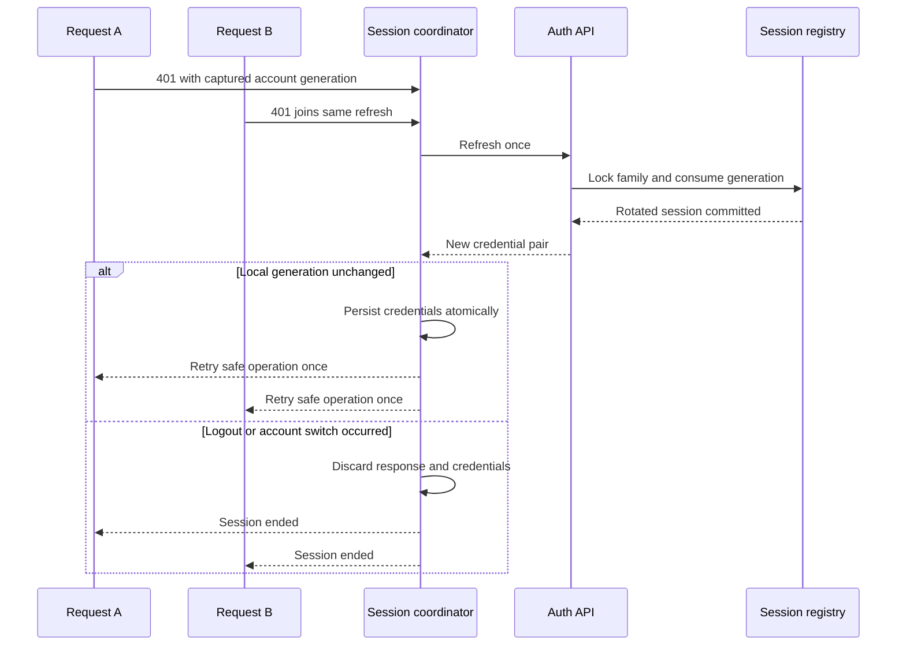
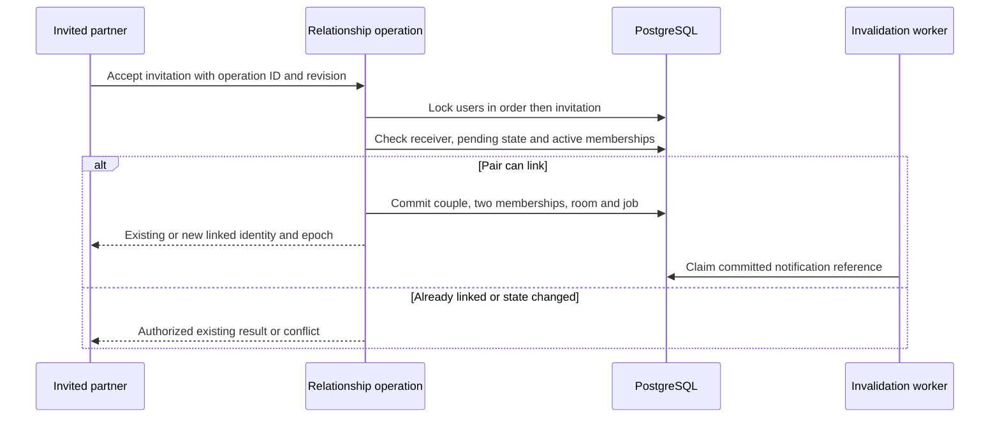
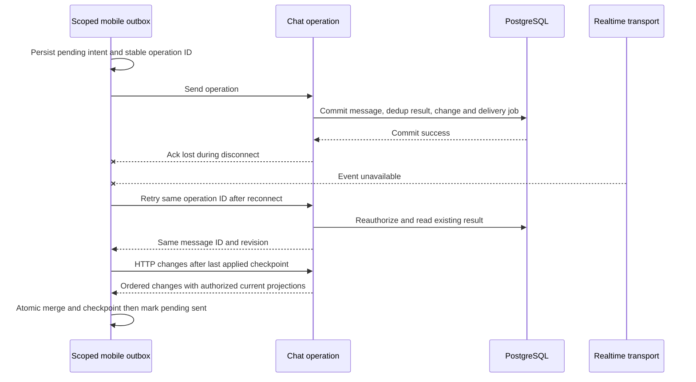
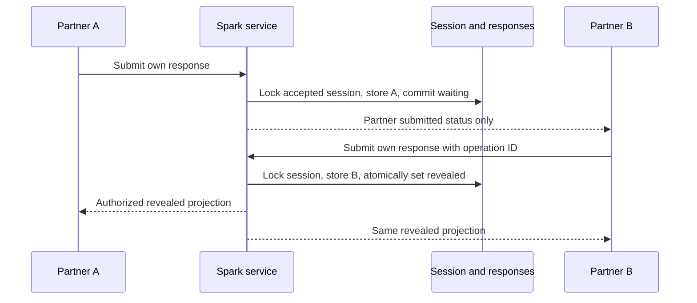
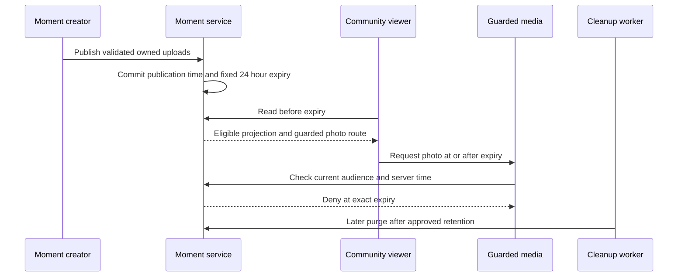

# Contracts and critical sequences

**PROPOSED 0.1.** Existing contracts continue unchanged until their slice is
approved. Paths prefixed `/api/v2/`, new fields, events and limits below are
proposals, not endpoints currently available. Synthetic examples contain no
real identities, tokens or private content.

## Authority and drift prevention

Design decisions live here in the frontend repository. During implementation,
the **backend repository** becomes the authoritative executable contract location:
`contracts/rest/openapi.yaml`, `contracts/realtime/schema.json`, synthetic
fixtures and `contracts/manifest.json`. The manifest records contract version,
schema digest, backend commit and minimum supported protocol. The frontend pins
an immutable artifact/digest in its own contract manifest; never consume a moving
branch or assume matching branch names mean matching contracts.

The [draft OpenAPI subset](contracts/openapi.proposed.json) and
[realtime draft schema](contracts/realtime.proposed.schema.json) in this design
are reviewable specifications for refresh and message recovery. They are not a
complete description of today's API or a second production schema registry.
Move accepted definitions into the backend authority in A/B/C, then replace these
drafts with links to the pinned artifact. Do not generate clients from this draft.

No contract tooling was found to preserve. Use OpenAPI 3.1 for HTTP and JSON Schema
2020-12 for realtime envelopes/payloads. A full AsyncAPI toolchain is unnecessary
for one socket initially. Evaluate DRF schema extraction against Django 6.0.3 and
DRF 3.17.1 before choosing its package/version; custom actions, multipart and
permissions still require explicit annotations and tests. Handwritten Kotlin DTOs
remain acceptable when validated against examples and server response schemas.

Backend CI checks actual responses and socket events against schema fixtures,
detects breaking changes against the released artifact, and publishes immutable
artifacts after approval. Mobile CI decodes the same fixtures, checks its pinned
digest and exercises supported legacy/current shapes. Paired PRs record both
commits, schema digest and Figma node references. A schema file alone does not
prove implementation conformance.

## Current surfaces and migration seams

| Observed current surface | Preserve until compatible replacement exists |
| --- | --- |
| `POST /api/auth/send-otp/`, `POST /api/auth/verify-otp/`, `/api/auth/setup-profile/`, `/api/auth/interests/` | Existing success envelope and `tokens.access`, `tokens.refresh`, `user`; additive server hardening in B1 |
| `/api/social/find-partner/`, `connect-couple/`, `couple-connection/`, `couple-profile/` | Old callers remain supported through a thin adapter to authorized relationship operations; remove broad profile disclosure separately |
| `/ws/chat/`: `action`, optional `request_id`, `payload`; old numeric message IDs and numeric history cursor | Adapter invokes the same new operations; do not reinterpret old IDs or claim legacy retries are deduplicated |
| `POST /api/chat/media-upload/` | Existing upload flow gets ownership enforcement before migration; preserve only authorized existing use |
| `/api/social/couple-moments/`, `couple-feed/`, `couple-faves/`, `couple-moments/sequence/` | Preserve signed cursor, eligibility, per-user Fave and photo-authorization rules; endpoint-specific decoders because response envelopes differ |

Legacy single-discovery endpoints are outside the intended product. Measure usage,
disable their entry points for new clients, then sunset explicitly; do not delete
their data or routes as part of OTP work.

## Common rules for new contracts

| Concern | Proposed rule |
| --- | --- |
| Identity | Treat IDs as opaque strings in v2. Preserve numeric v1 IDs and database PKs; a mapper converts without rewriting primary keys. Actor/creator comes from authenticated session, never trusted from request fields |
| Time | UTC RFC 3339 with explicit `Z`; server controls publication/expiry. Compare instants, not phone timezone. Responses include `server_time` for display offset, never as permission proof |
| Numbers | Sequence/revision are nonnegative 64-bit integers; Kotlin `Long`; code generators must preserve precision. UUID operation/event IDs are independent of entity IDs |
| Missing/null | Required fields cannot silently default. Explicit `null` means absent value; omitted PATCH field means unchanged. Empty collections are `[]`, not null |
| Enums | Document values; clients retain an `Unknown(raw)` state and do not make an unsafe default transition. Unknown additive fields tolerated. Unknown security/permission states fail closed |
| Versioning | Optional additions can be minor versions; type/removal/meaning changes require a negotiated major version or new field. Server supports released versions until measured adoption and an announced cutoff |
| Errors | Stable code plus safe message, field errors, `request_id`, `retryable`, optional `retry_after_seconds`. UI localizes by code, never parses English strings or displays traceback/provider text |
| Authorization | Bearer required except OTP entry. Return 404 for inaccessible object IDs to reduce existence disclosure; 403 for a known permitted object with disallowed action; 401 for invalid session |
| Updates | Optimistic `expected_revision` for editable resources; mismatch is 409 with authorized current revision. Retry cannot overwrite a partner's later change |
| Idempotency | Stable client UUID per logical mutation. Key includes actor and operation type; request fingerprint includes target/content. Same key + same intent returns stored result; different intent is 409. Reauthorize before returning old result |
| Retry | Safe reads: exponential jitter, honor Retry-After, bounded by foreground deadline. Writes: only replay with durable operation identity and known policy. A timeout can mean committed; reconcile instead of reporting definite failure |

Operation retention is explicit: message operation identity stays with message or
tombstone. Proposed short-lived invitation/Moment creation results survive at
least seven days; pending mobile retries stop at that horizon and query canonical
state. Refresh is a special non-replayable credential operation described below.
Profile replacement PUT can be idempotent, but multipart upload attachment is not
assumed safe to replay without a stable operation and upload identity.

| HTTP status / code | Client action / example |
| --- | --- |
| 200/201 | Commit canonical result into matching account/couple/room projection; clear pending state by operation ID |
| 400 `validation_failed` | Keep input; show `fields.phone_number = invalid_format` or `fields.photos = too_many` |
| 401 `session_expired` | Join one coordinated refresh if eligible; replay only authorized safe/idempotent request |
| 403 `creator_required` | Explain current user cannot edit the known Moment; refresh permission state |
| 404 `not_found` | Do not reveal whether an unrelated couple's object exists |
| 409 `revision_conflict`, `operation_key_reused`, `membership_changed` | Reload authorized state; never blind overwrite or reroute action to a new couple |
| 410 `resync_required`, `cursor_expired` | Discard that scoped cursor and reconcile a snapshot; preserve unsent local operations |
| 429 `rate_limited` | Display bounded retry time; do not automatically resend an OTP repeatedly |
| 503 `temporarily_unavailable` | For a mutation, outcome may be unknown; reconcile/retry same operation ID. Provider-specific details stay server-side |

Example error (proposed v2):

```json
{"error":{"code":"revision_conflict","message":"This item changed.","fields":{},"retryable":false,"current_revision":4},"request_id":"req-synthetic-01","server_time":"2026-09-26T10:00:00Z"}
```

## OTP, sessions and onboarding

B1 preserves current OTP endpoint shapes. A later additive challenge ID binds
verification to normalized phone, purpose, request generation and expiry; legacy
clients resolve the latest active challenge through an adapter. Server never
returns an OTP. Successful send means accepted for processing, not delivery.
Resend invalidates previous generations and cannot clear existing verification.
Ambiguous provider failure must not trigger unlimited billable retries.

Proposed `/api/v2/auth/refresh/` accepts the refresh credential and returns access,
rotated refresh, expiries and device session ID. Session registry is checked for
revocation in authenticated REST and realtime work. Use a proposed five-minute
access lifetime, 30-day absolute session limit and explicit device revocation.
These durations need product approval and must not be applied before B2's client.
JWT rotation settings alone do not implement session-family reuse handling.

One SessionCoordinator mutex/shared deferred operation joins concurrent 401s.
Refresh bypasses the normal bearer-refresh interceptor and uses only the trusted
origin. On success, credentials update atomically if captured generation still
matches; old requests cannot revive a logged-out session. Replay a GET or an
idempotent operation once; non-idempotent legacy sends require reconciliation.

Refresh rotates under a device-session row lock. Reuse of an already-consumed
refresh generation revokes its family. **Initial simplicity tradeoff:** if the
server rotated but the response was lost, the client requires reauthentication;
it does not blindly retry the same refresh. This can inconvenience users on poor
networks. A future bounded encrypted replay-response mechanism needs a separate
threat/design decision; do not silently add a reuse grace that aids stolen tokens.



`GET /api/v2/session/` proposes a server-derived projection: identity/profile
status, current couple ID, membership epoch, pending invitation, session expiry
and capabilities. The client maps it to `SignedOut`, `Verifying`,
`ProfileIncomplete`, `AwaitingPartner`, `Linked` or `Unlinked`. A network failure
is an availability overlay, not evidence that the user is signed out or single.
Privileged operations still reauthorize; this projection is not a permission token.

Local logout immediately hides content, invalidates generation and disposes the
session scope. Online `POST /api/v2/auth/logout/` revokes that device family and
closes subscriptions. Offline logout cannot promise server revocation: discard
credentials locally and explain that other devices/server sessions persist until
revocation or expiry. Do not retain the refresh secret merely to queue logout.

## Consent-based linking

Proposed exact-number lookup returns minimal display confirmation and a short-lived
opaque invitation target, never a general searchable directory or full profile.
Normalize phone before lookup, require a verified session, apply global limits
and make repeated probes costly. Existing broad serializer must not define v2.

New invitation operations carry stable operation ID, target reference and expected
revision. Sender comes from session. Crossed invites return the existing pending
pair and expose an explicit accept action; they do not implicitly create consent.
Accept is receiver-only; cancel sender-only; decline receiver-only. Retrying an
accepted invitation returns its existing couple if still authorized. Later
membership change yields conflict, never resurrection of a broken relationship.



Unlink takes the same guards as scoped writes, increments membership epoch,
invalidates current access and creates durable invalidation work. HTTP reads,
commands, subscriptions and each delivery check current authorization. Previously
downloaded bytes cannot be recalled. Historical access after unlink is an explicit
policy decision; default deny until approved, with no automatic transfer to a new
partner. Model migration must preserve original participant identities.

## Chat write, recovery and ordering

Proposed v2 HTTP endpoints provide room list, history, mutations and changes.
Socket commands invoke the same operations for latency; HTTP provides recovery
and a send fallback. Use at most one active attempt per pending operation locally.
Transport loss does not assign a new operation ID.

Example send (HTTP POST or socket command payload):

```json
{"client_operation_id":"00000000-0000-4000-8000-000000000001","room_id":"room-synthetic-a","membership_epoch":3,"text":"Synthetic hello","media_ids":[],"reply_to_id":null}
```

Successful post-commit result:

```json
{"data":{"message":{"id":"42","room_id":"room-synthetic-a","sender_id":"7","client_operation_id":"00000000-0000-4000-8000-000000000001","sequence":81,"revision":1,"text":"Synthetic hello","media_ids":[],"reply_to_id":null,"deleted":false,"created_at":"2026-09-26T10:00:00Z"},"change_sequence":96},"request_id":"req-synthetic-02","server_time":"2026-09-26T10:00:00Z"}
```

`sequence` orders message creation; `revision` orders changes to one message;
`change_sequence` orders recoverable room mutations. Socket events also carry a
unique `event_id`, version/type, room ID and membership epoch. They are hints to
merge or fetch authorized state. An event for A updates only A's projection,
regardless of active screen B. Dedupe by event ID, ignore older entity revisions,
and recover sequence gaps via HTTP. Unknown event types do not crash the client:
record a redacted metric and resync if their sequence advances known state.



New history is keyset-paginated by `(room_id, message_sequence)`, descending for
older messages; cursors are opaque, signed, user/room/purpose-bound, maximum page
50. Sort oldest-to-newest for rendering without changing cursor semantics. Room
lists use `(updated_at, room_id)` tie-breakers and dedupe repositioned rooms.
Existing numeric cursor behavior is unchanged in v1.

A changes response returns authorized mutations through a fixed high-water mark
and a next cursor. Apply page and checkpoint in one local transaction. Snapshot
recovery reads history plus a consistent high-water mark; buffered/live events
above it are applied afterwards. History pagination must carry snapshot position
so messages arriving mid-pagination are obtained through changes, not silently
skipped. Seven-day change retention is proposed. A too-old cursor returns 410;
discard old server projections or reconcile tombstones, preserve pending intent,
then take a fresh scoped snapshot. Never reset pending messages as though sent.

Snapshot cursors carry both the message-creation boundary and change checkpoint,
plus actor/room/epoch/purpose. The first read establishes them consistently in a
short database transaction. Later pages may contain a more recent authorized
entity projection; revision comparison prevents regression when the corresponding
change is subsequently replayed. Do not hold a database transaction open across
mobile pagination requests.

State semantics: `pending` = durable local intent; `sending` = active attempt;
`sent` = server commit acknowledged/reconciled; `delivered` = at least one eligible
recipient device durably applied through that sequence; `read` = recipient viewed
the conversation through an observed sequence while foreground. Receipt requests
carry `through_sequence`, must reference accessible messages and advance only
monotonically. Server receipt time is authoritative; a socket connection alone
does not prove delivery/read. Other own devices sync via the same recovery path.

Edit uses expected revision and sender ownership; delete-for-everyone replaces
content with a tombstone, scrubs reply previews and schedules media deletion when
unreferenced. Delete-for-me records a user-specific visibility tombstone, including
that user's other devices. Reactions use per-user uniqueness and an idempotent
desired value. Exact edit/delete time windows need product approval; do not add
an arbitrary restriction while preserving current functionality.

Typing/presence are ephemeral, throttled and expire after roughly ten seconds.
On background, suspend active socket work according to platform lifecycle; on
foreground, revalidate session/membership then resume from checkpoint. APNs/FCM
can hint at changes; absence of push cannot prevent HTTP recovery.

Starting resource budgets below are proposals to load-test in C1/C3, not limits
already enforced by the current application. Limit-error telemetry contains no
payload content. Legacy-client compatibility must be considered before enforcement.

| Resource | Proposed budget / overload behavior |
| --- | --- |
| Socket application frame | 64 KiB maximum; new text send <=4,000 characters; images upload over HTTP, not socket frames. Preserve longer valid historical text in responses |
| Connections | Two sockets per device session, six per account, plus bounded unauthenticated handshake rate per IP/network; tune for real multi-device use |
| Commands | Per-user message burst 10, refill 5/s; typing <=1 update/s; separately bound reads, uploads and reactions. Return explicit rate-limit/backoff, never silently accept dropped commands |
| Outbound connection queue | At most 256 frames or 1 MiB; coalesce/drop ephemeral typing first. If durable hints cannot queue, close slow connection with retry guidance and recover via HTTP; never silently lose authoritative DB state |
| Client event processing | Bounded channel; durable changes checkpoint only after DB apply. Overflow marks sync-needed/reconnect rather than using DROP_OLDEST as though all events were processed |
| Provider jobs | Lease/retry with jitter and finite age/attempt budget; notification initial proposal eight attempts within 24 h, always rechecking content/session eligibility. Do not apply notification retry policy to billable OTP dispatch |

Measure limits under legitimate image uploads, two devices, slow recipients and
reconnect storms. Separate expected throttling from unexpected errors in metrics.

## Sparks, Challenges and Moments

Sparks propose versioned curated templates with one initial interaction type:
text answer hidden until both accepted participants submit. Each session pins
template version and original members. PUT own response has operation ID and
expected revision; session lock serializes submit/edit/skip/reveal. Before reveal,
the partner's answer is **absent from serialized responses and events**, including
previews and logs. Response availability may be visible; the text is not. New
template edits cannot change an in-progress prompt.



An edit racing reveal either commits before reveal or receives `session_revealed`;
it never silently changes an answer the other partner already saw. Pause/skip
policy is explicit and never reveals incomplete answers. Repeated submission or
completion produces no duplicate side effects. Unlink invalidates the session;
withdrawal and historical visibility remain approval decisions.

Challenge operations are invite/accept/decline, contribution PUT, pause/resume,
cancel and confirm-complete. Both accepted members confirm completion; transaction
locks instance, verifies both confirmations and commits one completed transition.
Template includes duration, together/apart and cost category. Private contributions
do not become Moment fields. Django admin publishes validated template versions
without modifying existing instances. No photo proof, streak penalties or rankings.

Moment publication retains creator-only editing/deletion and <=5 photos. Proposed
staged uploads carry uploader, target couple/epoch, verified type/size and expiry;
finalize locks parent and claims only eligible uploads atomically. Photo ordering
is explicit. Publish assigns immutable server `published_at` and expiry once.
Legacy records retain their original created-at/expiry; adding a new Moment never
renews another. Pending draft/staging is new behavior, not current API capability.



Expiry predicate is `now < expires_at`, including detail, feed hydration, sequence,
notes and photo requests. Worker delay does not extend access. KMP uses server
offset for countdown and hides expired content on resume but never authorizes it.
Prefer current authorized proxy for launch: `private, no-store` and no public
bucket. If direct signed URLs are later accepted, TTL must be at most the remaining
visibility and a short cap; they still cannot promise immediate block/unlink
revocation before expiry. See the privacy decision before choosing that tradeoff.

Discovery retains one card per couple, requester-bound feed order snapshots,
live eligibility and separate Faves. Global uses current configurable locality,
interests, freshness, Faves preference and exploration weights as an initial
heuristic, not a validated recommendation model. Empty Faves stays empty with an
explicit Global action. Low Global content broadens non-sensitive ranking filters
but never permissions or expiry. Seen state is per viewer, time-bounded and opt-out
compatible; hides/blocks suppress before ranking and again on delivery. Preserve
existing 409 preference-change and 410 expired-session cursor behavior.

“Try This Together” accepts an approved template ID and operation ID to create a
private proposal for the viewer's couple. Resolve template availability directly;
an expired source Moment grants no media access. Do not copy responses/photos,
identify the inspired couple publicly, or notify the original creator by default.

## Field traceability through the client

| Backend field / projection | DTO seam | Proposed domain / UI state and rule |
| --- | --- | --- |
| Current `tokens.access`, `tokens.refresh`, `user` | `features/auth/data/remote/response/OtpVerificationResponse.kt` | SessionCoordinator owns credentials; auth state uses identity/profile status. Tokens never enter Compose state or logs |
| New `session_id`, `membership_epoch`, capability projection | New session DTO, not a replacement user model | Session scope and couple scope guard every result; onboarding state is server-derived |
| Current message `id`, `chat_room_id`, `sender_id`, `timestamp` | `features/chat/data/remote/dto/ChatMessage.kt` | Typed MessageId/RoomId/UserId/Instant mapper; immutable message projection separated from upload progress |
| New `client_operation_id`, `sequence`, `revision` | Version-specific message/event DTO | PendingMessage matches exact operation; reducer never matches “first image” or active room fallback |
| Current boolean receipt flags → new participant high-water marks | Legacy adapter plus v2 receipt DTO | Derived sent/delivered/read indicator, monotonic across devices |
| Moment creator, original audience, visibility, immutable times, ordered photos | Proposed feature-specific Moment DTO | Creator action availability and expiry presentation; server still enforces rights |
| Spark own response, partner status, authorized reveal projection | Proposed Spark DTO variants | Waiting UI cannot access a hidden partner answer because it was never transmitted |
| Challenge template version, participant confirmations, revision | Proposed Challenge DTO | Separate per-person progress from joint completion; repeated taps reuse operation ID |

Mapping tests validate required IDs, parse timestamps once and surface malformed
responses as recoverable protocol errors. They must not reinterpret an absent
permission field as granted access. Implementation paths in this table are seams,
not instructions to create every class before the first slice.
