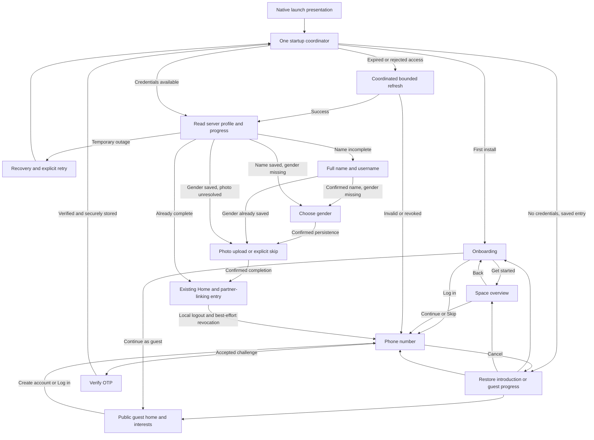

# Authentication phase 1 — onboarding, guest entry and secure sessions

Implemented 2026-09-28 across both `dev-core-architecture` branches. The user-supplied
Onboarding and Space exports unblock the visual work after the Figma MCP quota
failure. This document distinguishes implemented behavior from the remaining
native-device and rollout checks.

## Source and working-state record

| Source | Working branch | Starting commit |
| --- | --- | --- |
| Frontend `SriZan12/SriSu` | `dev-core-architecture` | `23ccd1f374a00207f32a4ac124250033b743689e` |
| Backend `SrizanKhadka/SriSu` | `dev-core-architecture` | `e63a322cc76c304008a408232ea476f140fc2b04` |

Both remote working-branch heads were read and match these starting commits.
Integration branches remain distinct: frontend `dev-new-theme` was
`3fa6822ea05578d64cca8891c5e3fdb0a831897a`; backend `dev` was
`ecc8592307114e7d154bda9612e6826e2ca8ba90`. Neither was merged/switched/reset.

The frontend started with 11 dirty files: Gradle; API environment, HTTP/result and
socket foundations; Chat socket/FindPartner ViewModel; Profile API; core integration,
contract fixture and parsing tests. Their initial diff/fingerprints were saved to
`/tmp/srisu-auth-initial/`. Existing unrelated changes remain. Necessary overlapping
edits preserve that work; HTTP body logging is deliberately removed for credential
safety. The fixture generator now preserves the user's uppercase/singular names,
resolving the initial generated-fixture baseline failure. Backend started clean.

Backend implementation commit: `b9160da83430b4b4c1fbac71d3cb1fcad2ab3860`. The paired frontend implementation
is the commit containing this handoff on `SriZan12/SriSu:dev-core-architecture`.

## Audit and decisions

* Client OTP send was disabled, wrote an unverified local Session and navigated
  without server acceptance. Phone UI also navigated unconditionally a second time.
* Requesting OTP unverified established identities. Codes were plaintext and used
  ordinary PRNG; validation and consumption raced, expiry used mutable timestamps,
  and failed verifications were unbounded.
* Startup trusted remembered secure-store profile flags, with no authoritative
  bootstrap/recovery state. No refresh or server logout endpoint existed.
* Profile completion required DOB, zodiac and gender, while the client also asked
  relationship status. The name step never persisted independently. Usernames had
  no uniqueness constraint. Optional photos had no explicit skip state.
* System photo pickers were wrapped in unnecessary storage-permission prompts;
  reads were unbounded. OTP countdown restarted when expired or recreated.
* Existing product behavior permits completed, unlinked users at Home, where Find
  Partner remains available. Couple authorization remains server-controlled.

The user explicitly delegated the session-policy decision during this task.
Selected: retain SimpleJWT/KVault; introduce revocable device sessions, 10-minute
access, rotating refresh and a 30-day absolute session maximum. This is additive,
with explicit configurable legacy compatibility; no new transport/storage stack.

## Implemented routing

Introduction progress lives in the existing DataStore under versioned keys, separate
from secure credentials. First install opens Onboarding. Get started opens Space;
Continue and Skip both advance to Phone. Log in bypasses Space. Guest mode is a
persisted signed-out destination. Cancelling Phone returns to its saved origin,
including guest entry after process restart. Known accounts mark the introduction
passed; logout and invalid credentials return to Phone. Preference failures expose
retry; duplicate taps and stale guest callbacks cannot grant protected access.

The five segments on Space retain the supplied introductory artwork; they are not
a screen count or a five-screen carousel. Profile setup has its own three-step
indicator: Name, Gender, Photo. DOB, zodiac and relationship questions remain
outside this registration flow.

Guest home, public interest search and an account prompt are derived additions,
authorized by the user's guest clarification. The only existing public content API
is `GET /api/auth/interests/`; Home was a placeholder. Guests can browse/search that
real catalogue and use its existing five-minute/24-hour offline cache. Loading,
empty, no-results, offline, failure, retry and permission rejection are represented.
No sample personal feed, guest identity, private API permission change or new
endpoint was invented. Personal/shared activity requires authentication. Public
requests omit bearer credentials and never refresh/clear an existing session.
The guest shell never constructs the protected graph, its ViewModels or sockets.

`StartupCoordinator` is application-owned and coalesces one current-user attempt;
a retry cancels/replaces it. Identity generation guards reject obsolete results.
Missing/unknown progress is a recovery state. Network/503 errors keep credentials
and do not mount protected navigation. Profile saves feed their confirmed response
back to the coordinator without another bootstrap request. Authentication and
protected graphs are separate; account changes destroy the account ViewModel store.
Consumed OTP routes disappear after authentication. Name, gender and photo are the
registration steps reachable from the profile flow.

Refresh runs in the existing SessionCoordinator's mutex before expiry and once
on an authenticated 401. GET/HEAD can retry once after renewal; writes are never
replayed. Failed connectivity retains credentials. Stable refresh request IDs live
only with credentials in KVault; a lost response can be reconciled for 60 seconds.
Different reuse revokes the device session. Logout wins over late refresh. Credential
rotation signals the existing socket owner to reconnect; it does not change account
identity. No new Chat transport was introduced.
Socket handshakes use the same refresh gate; an expired open connection can renew
on bounded reconnection. Other authentication denials clear the account scope.
Valid legacy access-only sessions remain usable until expiry or a server rejection;
only sessions with a refresh proof attempt the proactive device-session upgrade.

Native Android uses AndroidX SplashScreen 1.0.1 in MainActivity with no separate
activity, network keep condition or artificial delay. iOS uses `UILaunchScreen`
with a light/dark color asset; runtime resolution is in the app. Both use existing
theme background colors. The runtime loading/retry composable owns no routing.
References: [Android](https://developer.android.com/develop/ui/views/launch/splash-screen),
[Apple](https://developer.apple.com/documentation/xcode/specifying-your-apps-launch-screen),
[Compose lifecycle](https://kotlinlang.org/docs/multiplatform/compose-lifecycle.html).

## Contracts and compatibility

Backend `contracts/core-1/` remains authoritative. Auth success additions use the
same data envelope and `X-SriSu-Contract: core-1` safe errors. New mobile clients
send `X-SriSu-Auth: auth-1` for device-session issuance and explicit photo skipping.
The shared fixture/schema bundle includes challenge, profile/progress, verification
and refresh shapes; KMP parses the pinned examples and backend tests validate real
responses. See backend `docs/authentication.md` for full endpoint/deployment detail.

* Send accepts phone plus optional UUID request_id; returns challenge_id,
  expires_at/resend_at/server_time and retry_after_seconds. Resend is server-enforced.
* Verify accepts phone, six ASCII digits, optional challenge_id for legacy clients.
  Invalid/expired/consumed/exhausted errors are field codes, never auth-token 401s.
* Existing GET/PATCH/PUT setup-profile returns user plus domain progress:
  next_step=name/photo/complete, phone_verified/profile_complete/photo_skipped,
  membership=linked/unlinked and nullable couple_id. It creates no couple.
* Name saves and upload/skip are separate actor-bound writes. Exact nonempty
  username uniqueness is enforced in the database without case-folding existing
  accounts. Display names preserve Unicode and spaces, trimmed only at edges.
* Gender uses the existing actor-bound PATCH setup-profile with only
  `{"gender":"FEMALE"}` or `{"gender":"MALE"}`. The server's existing `photo`
  phase opens Gender first when that incomplete user's returned gender is missing;
  no new wire `next_step` value or backend completion requirement is introduced.
* Profile images: maximum 5 MiB, 20 megapixels, dimension 8192, JPEG/PNG/WebP;
  bounded client reads, server validation, metadata-stripping re-encode and random
  server filename. A preview is never completion. System pickers require no broad
  media-library permission for this flow.

Deploy backend and migrations before mobile. Migration 0021 fails on duplicate
exact usernames, leaves identities unchanged, and invalidates old short-lived OTP
proofs. It adds explicit photo skip state and keeps completed legacy accounts
complete. 0022 adds DeviceSession. No production/shared database was queried or
migrated. Run the read-only identity audit on an approved data copy first. No silent
renaming, deleted users, provider migration or signing-key rotation occurred.

## Figma and assets

Figma file `LztysD1YvINX7RwZpnhhTt`, user-supplied
[Auth page 1:2](https://www.figma.com/design/LztysD1YvINX7RwZpnhhTt/Srisu?node-id=1-2).
MCP page inventory returned `0:1`; metadata, design-context and read-only `use_figma`
calls subsequently returned the Starter-plan call limit. Exact child-frame IDs,
variables, variants and prototype connections remain unverified. The user's
`Onboarding Screen.png` (1179×2556) and `Space screen.png` (1395×2772), supplied
2026-09-28, are the approved visual references. Neither screenshot is embedded as UI.

| Reference | Implementation and fidelity decisions |
| --- | --- |
| Onboarding export | `IntroductionScreens.kt::OnboardingScreen`; bundled Instrument Serif/Satoshi, orange dot, exact landscape geometry, responsive text and bottom actions |
| Space export | `IntroductionScreens.kt::SpaceScreen`; serif heading, five segments, pastel cards, Back/Skip/Continue |
| Landscape | Existing `partner_invite_landscape.xml` copied to `onboarding_landscape.xml`; only viewport widened and group translated to include the full original paths/fills shown in the export |
| Feature icons | Small four-point vector sparkle derived from the supplied image; existing Material calendar/image/arrow/chevron icons (calendar grid differs from the export's three dots) |
| Theme | Existing shared fonts, buttons, fields, spacing and shapes; screenshot-derived feature colors/geometry live in `IntroductionTokens.kt` |
| Guest shell | Derived from those components; no separate guest Figma frame supplied |
| Dark mode | Derived theme containers and existing role pairs; decorative artwork stays unchanged |

Native status/home bars are provided by the OS. The Space mockup's outer device
frame/noise/shadow are omitted. Controls keep minimum touch targets and layouts
scroll under text growth; physical-screen dimensions/safe areas differ from the
exports. No placeholder art is added. Phone, OTP, name and photo retain existing
theme components because their current Figma frames were unavailable.

## Verification and limits

Commands/results are recorded in the companion [validation record](authentication-validation.md).
A native iPhone 17 Pro/iOS 26.5 build and launch succeeded, and the existing phone
screen was visually inspected: [screenshot](authentication-validation/ios-phone-light.png).
The introduction exports were also compared with native captures. This is not proof of end-to-end device OTP/upload behavior.
No real SMS or production account was used. Android runtime, keyboard/VoiceOver
and the full native lifecycle matrix remain unverified. See the validation record
for native capture coverage and its limits.

Known limits/release gates:

* Exact Figma child-frame IDs/prototype wiring remain unavailable; supplied exports
  and the approved flow define this implementation.
* PostgreSQL 17.11 was installed for disposable concurrency verification. All 122
  selected backend tests passed on PostgreSQL, including duplicate send/verify,
  exact username claims, refresh rotation/replay and legacy-upgrade races. The
  temporary cluster was stopped and removed; no background service was registered.
* Announce and enforce the legacy-token cutoff; compatibility defaults to enabled.
  Old access tokens remain unrevocable until cutoff. The new client upgrades a
  valid legacy refresh proof through the device-session path during restoration.
* Offline local logout clears local authority immediately; server revocation is
  best effort and is not a durable offline revocation queue. Secure-store hardware
  failure needs native testing. Refresh recovery after its 60-second retry window
  requires reauthentication rather than weakening replay protection.
* Configure Twilio/provider spend controls, ingress client-IP handling and suitable
  global/source budgets. Defaults are conservative (100/hour globally, 10/hour/source),
  and the database global budget row deliberately serializes this modest SMS load.
* Core account cleanup/socket integration changed only as required by authentication.
  Chat, Sparks, Challenges, Moments, discovery and partnership creation were not refactored.

Publication remains on the existing feature branches; no integration branch merge
or deployment is part of this change. Unrelated local frontend edits are preserved.

## Gender step — 2026-09-29

The existing `SelectGenderScreen` is now between Name and Photo. Next is disabled
until a choice is made and while saving; the screen advances only on the confirmed
profile response. Failed saves keep the choice and allow explicit retry. Back and
system Back follow Photo → Gender → Name, retaining the selection in the current
flow, and are ignored while a write is pending. The cards expose radio selection
semantics. Saved gender restores from the server after restart; an incomplete
profile with no saved gender resumes on Gender. Completed accounts, including older
accounts without gender, keep their normal Home destination. Guest access is unchanged.

This is a client onboarding question, not a server authorization rule. Existing
auth-1 clients, server progress values and profile-completion semantics remain
compatible. The backend already validates the two supported values and persists
gender through GET/PATCH `/api/auth/setup-profile/`; no backend change or migration
is needed. The real KMP-to-Django check writes both values, reads them back, and
checks rejection of `NONE`. Backend source: `SrizanKhadka/SriSu` feature commit
`c622e7fdb85806d2e5d279aad7a537b0d2cc8a73`; frontend base:
`c20d65252fb309b132120331401c81a8b7562777`. The frontend commit containing this
handoff is the implementation revision on `dev-core-architecture`.

Figma page `1:2` metadata was readable on this pass; the next call hit the Starter
quota before the gender frame/design context could be verified. This change reuses
the existing screen's layout, artwork, labels and theme tokens. The three-step
profile indicator is derived from the updated flow. See the
[validation record](authentication-validation.md#gender-step--2026-09-29).

## Important implementation files

| Area | Frontend paths under `composeApp/src/` | Backend paths |
| --- | --- | --- |
| Startup and root access | `commonMain/kotlin/com/srisu/srisu/features/auth/domain/StartupCoordinator.kt`, `app/AppRoot.kt`, `app/StartupPresentation.kt` | `authentication/progress.py` |
| Session lifecycle | `commonMain/kotlin/com/srisu/srisu/core/session/SessionCoordinator.kt`, `SessionRefresh.kt`, shared `core/data/remote/` | `authentication/sessions.py`, session endpoints in `authentication/api/views.py`, `chat/middleware.py` |
| OTP and incremental profile | `features/auth/data/remote/api/AuthApiService.kt`, `features/auth/presentation/vm/AuthViewModel.kt`, existing auth screens (commonMain package above) | `authentication/otp.py`, `authentication/api/serializers.py`, `authentication/api/views.py` |
| Native startup and photos | Android `MainActivity.kt`, native styles; iOS `Info*.plist`/LaunchBackground asset; platform `MediaManager` implementations | Photo validation in serializer |
| Data and coverage | `commonTest/kotlin/com/srisu/srisu/core/AuthenticationFlowTest.kt`, `contracts/core-1/` | `authentication/models.py`, migrations `0021`/`0022`, `authentication/test_auth.py`, `tools/auth_postgres_tests.py`, `contracts/core-1/` |
